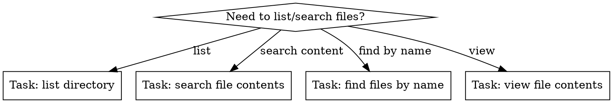

# CLI Speed Tools

> Part of [klh/skills](https://github.com/klh/skills) — personal agent skills by [Klaus L. Hougesen](https://github.com/klh).
> Install: `npx skills add klh/skills --skill klh-cli-speed-tools`

## Overview
Modern CLI tools provide 10-100x speed improvements over standard utilities while adding useful features like git status, syntax highlighting, and fuzzy search.

## Quick Reference

| Task | Slow (avoid) | Fast (use) |
|------|--------------|------------|
| List files | `ls`, `ls -la` | `eza -la`, `eza --tree` |
| Search content | `grep -r`, `find` | `rg` (ripgrep) |
| Find files | `find` | `fd` |
| View files | `cat` | `bat` |
| Fuzzy search | — | `fzf` |
| Kill processes | `kill`, `pkill` | `fk` (fkill) |
| Dir navigation | `cd` everywhere | `z` (frequency-based) |

## When to Use



## Core Tools

### EZA (Modern ls)
```bash
# Detailed list with icons, git status, dirs first
eza -la --icons --git --group-directories-first

# Tree view (2 levels deep)
eza --tree --level=2 --git --icons
```

### Ripgrep (rg)
```bash
# Search for pattern in all files
rg "pattern"

# Case-insensitive search with context
rg "pattern" -i -C 2

# Search specific file types
rg "pattern" -t ts -t js
```

### FD (Fast find)
```bash
# Find files by name
fd "filename"

# Find by extension
fd "\.ts$"

# Include hidden files
fd "pattern" --hidden
```

### BAT (Enhanced cat)
```bash
# View file with syntax highlighting
bat filename.txt

# View specific lines
bat filename.txt -l 10-20
```

### FZF (Fuzzy finder)
```bash
# Interactive file selection
fzf

# Pipe into fzf for selection
fd | fzf
```

## Implementation

These tools should be pre-installed in the environment. Check availability before use:

```bash
# Verify tools are available
command -v eza && echo "eza available"
command -v rg && echo "ripgrep available"
command -v fd && echo "fd available"
command -v bat && echo "bat available"
```

## Common Mistakes

| Mistake | Fix |
|---------|-----|
| Using `ls -la` | Use `eza -la` or `l` alias |
| Using `grep -r "pattern"` | Use `rg "pattern"` |
| Using `find . -name "*.js"` | Use `fd "\.js$"` |
| Using `cat file.txt` | Use `bat file.txt` |
| Forgetting `--hidden` | Add it for fd/rg to search hidden files |

## Real-World Impact

- **10-100x faster** than standard tools on large codebases
- **Git status built-in** to directory listings
- **Syntax highlighting** for code viewing
- **Fuzzy search** reduces typing and matches intent

## Aliases Available

```bash
l      # eza -la with header, git, icons
la     # eza -la with classify, icons, git
ltree  # eza tree view
sf     # fzf file picker → Sublime
sgr    # ripgrep+fzf → open at line
fk     # fzf process killer
```

## Integration with Other Skills

- **klh-find-bugs** — use CLI speed tools to quickly search and inspect code during bug investigations
- **klh-code-simplifier** — fast file operations support efficient code refactoring workflows
